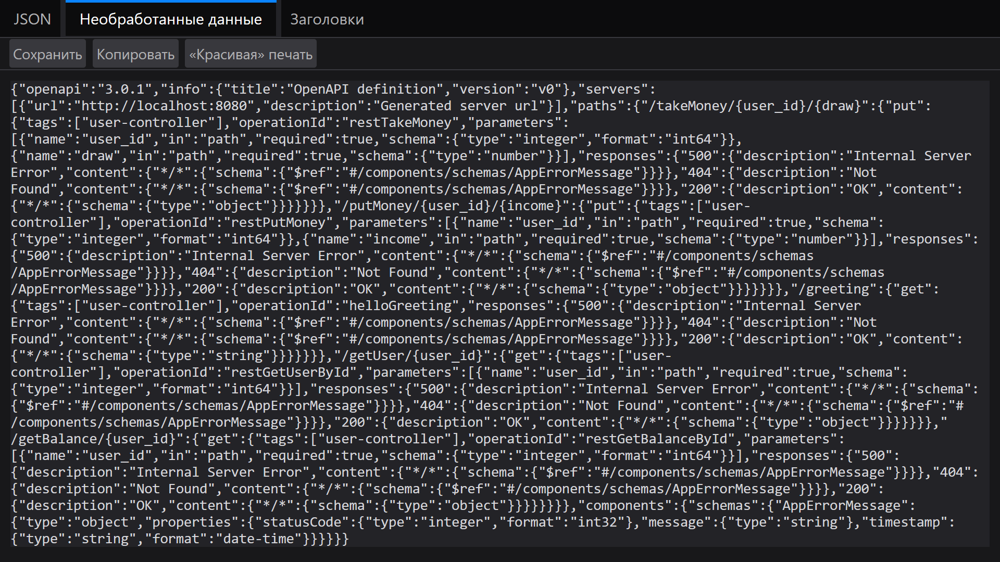
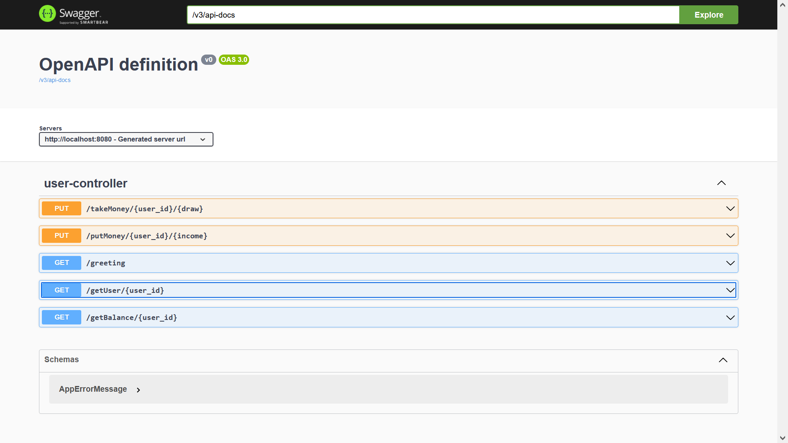
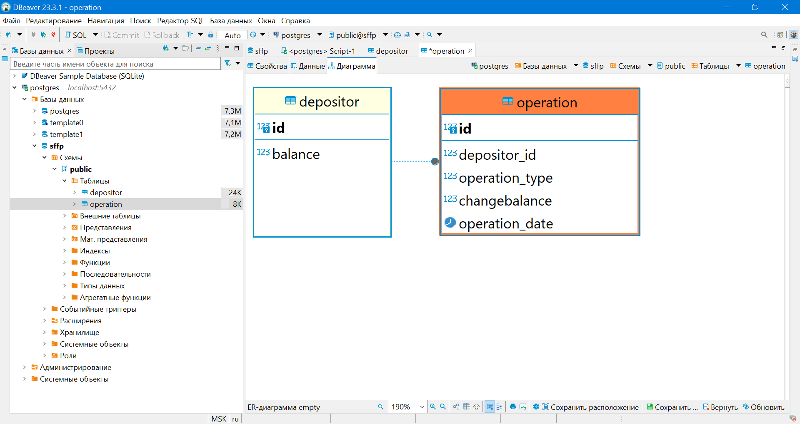

SkillFactory (on-line study platform) final project for speciality "Java-Developer" (stream Java-34).
Prototype REST API back-end part for typical web-bank client.

06-jan-2024.
Stage #1 (work with balance).
Released three (REST) methods:
1. getBalance ("/getBalance/{user_id}")
   in right case return JSON like {"id":1,"balance":15000.00},
   in wrong case - {"statusCode":-1,"message":"User with ID=0 not found / not exist.","timestamp":"2024-01-06T16:04:18.903+00:00"}.
2. putMoney (PUT "/putMoney/{user_id}/{income}")
   in right case return JSON like {"statusCode":1,"timestamp":"2024-01-06T16:13:46.995+00:00"},
   in wrong case - {"statusCode":0,"message":"User with ID=4 not found / not exist.","timestamp":"2024-01-06T16:13:52.773+00:00"}.
3. takeMoney (PUT "/takeMoney/{user_id}/{withdraw}")
   in right case return JSON like {"statusCode":1,"timestamp":"2024-01-06T16:13:46.995+00:00"},
   in wrong case - {"statusCode":0,"message":"User with ID=4 not found / not exist.","timestamp":"2024-01-06T16:13:52.773+00:00"}
   or {statusCode":0,"message":"Operation: draw can't be executed. User with ID=3 current balance lesser than draw.","timestamp":"2024-01-06T16:13:52.773+00:00"}.

07-jan-2024.
Interstage.
Add Swagger (OpenAPI) v3 integration.
http://localhost:8080/v3/api-docs
http://localhost:8080/swagger-ui/index.html#

14-jan-2024.
Stage #2 (getOperation).
Released one (REST) method:
1. getOperation ("/getOperation/{depositorDonorId}")
   - in right case return JSON like LIST with all Depositor operations: 
   [{"id":1,"depositorDonorId":1,"depositorAcceptorId":1,"operationType":1,"changeBalance":500.00,"operationDate":"2024-01-16T22:35:59.862128"},
   {"id":3,"depositorDonorId":1,"depositorAcceptorId":1,"operationType":1,"changeBalance":500.00,"operationDate":"2024-01-16T22:38:21.630707"},
   {"id":5,"depositorDonorId":1,"depositorAcceptorId":1,"operationType":1,"changeBalance":500.00,"operationDate":"2024-01-16T22:38:30.313555"},
   {"id":7,"depositorDonorId":1,"depositorAcceptorId":1,"operationType":1,"changeBalance":500.00,"operationDate":"2024-01-16T22:38:39.513291"},]
   - in wrong case (if Depositor not found/not exist) return empty JSON: [].

27-jan-2024.
Stage #3 (getOperationList).
Released one (REST) method:
1. getOperationList ("/getOperationList/{depositorDonorId}") with two optional time parameters: begin date and finish date,
   what allow select operations in time interval/span.
   - in right case return JSON like LIST with all Depositor operations:
        [{"id":1,"depositorDonorId":1,"depositorAcceptorId":1,"operationType":1,"changeBalance":500.00,"operationDate":"2024-01-16T22:35:59.862128"},
        {"id":3,"depositorDonorId":1,"depositorAcceptorId":1,"operationType":1,"changeBalance":500.00,"operationDate":"2024-01-16T22:38:21.630707"},
        {"id":5,"depositorDonorId":1,"depositorAcceptorId":1,"operationType":1,"changeBalance":500.00,"operationDate":"2024-01-16T22:38:30.313555"},
        {"id":7,"depositorDonorId":1,"depositorAcceptorId":1,"operationType":1,"changeBalance":500.00,"operationDate":"2024-01-16T22:38:39.513291"},]
   - in wrong case (if Depositor not found/not exist) return empty JSON: [],
   if one or both optional parameters is empty return all operation list like above method "getOperation".

27-jan-2024.
Stage #4 (Optional).
   Add tests:
   1. @SpringBootTest Application contextLoad().
   2. DepositorRepositoryTest and OperationRepositoryTest by using test scope in-mem H2 data-base
      (add test properties in ./src/test/resources/application.properties).
   3. Add test DB-data in ./src/import.sql.
